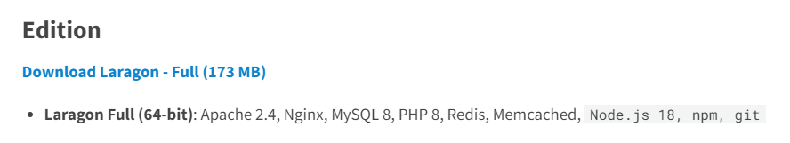
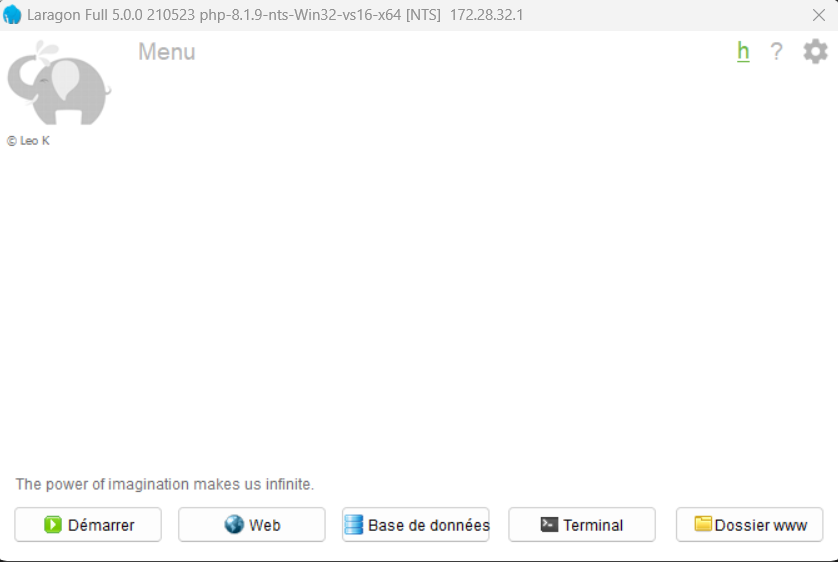

# Introduction à PHP

Présentation : [Introduction PHP](https://docs.google.com/presentation/d/1xYucwulBekH6t9DqX0FybRWygCMcaIM_y-jnboxtYdk/edit#slide=id.g23a5e8ed058_0_9)

## Installer un environnement de développement 

Pour travailler avec php, il va falloir installer un environnement de développement. 

Pour cela je vous propose d'installer Laragon qui est un logiciel permetant de simuler un serveur uniquement en local sur votre ordinateur

### Rendez vous sur la page de téléchargement de [laragon](https://laragon.org/download/index.html)
    
- Cliquez sur Download Laragon - Full


- Lancer l'installation

- Une fois installé voici l'interface que vous devriez obtenir 


Cliquer sur démarrer est voilà votre serveur local est maintenant installé.


## Créer des fichiers PHP

- **Ouvrir le dossier www** : Dans la fenêtre de Laragon, clique sur le bouton "www". Cela ouvrira le dossier où tu peux créer tes projets PHP.

- **Créer un nouveau dossier** : Dans le dossier www, crée un nouveau dossier pour ton projet. Par exemple, tu peux le nommer "mon_projet". Une fois créé ouvre le dossier avec VSCode.

- **Créer un fichier PHP** : Dans le dossier de ton projet, crée un nouveau fichier avec l'extension ".php". Par exemple, tu peux le nommer "index.php".

- **Écrire du code PHP** : Ecris ton premier code PHP. Par exemple :

```php
<?php
echo "Bonjour, monde!";
?>
```

- **Voir le résultat** : Pour voir le résultat de ton code PHP, ouvre ton navigateur et va à l'adresse "http://localhost/mon_projet". Tu devrais voir le message "Bonjour, monde!".


Et voilà tu est maintenant prêt à coder en PHP ! 

